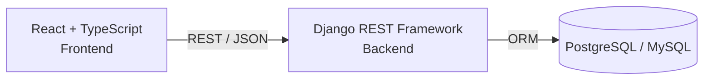
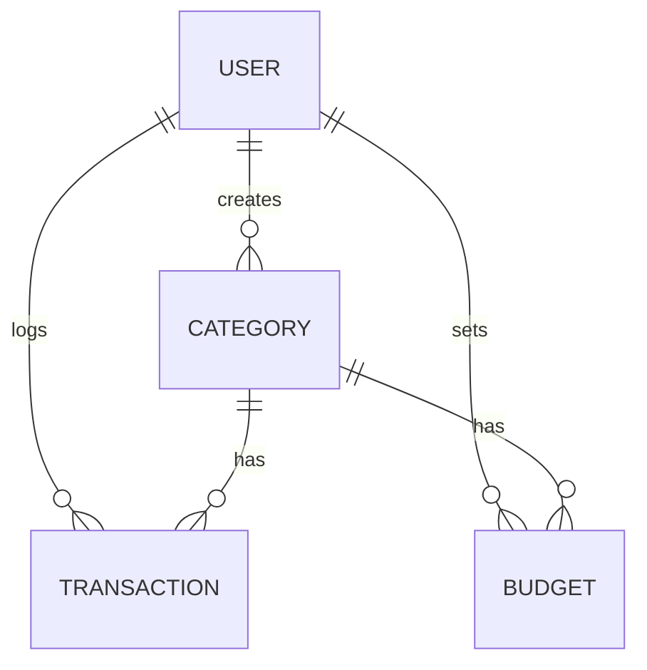

<div align="center">
  
<a href="https://git.io/typing-svg">
  
</a>

[](https://www.djangoproject.com/)
[](https://reactjs.org/)
[](https://www.typescriptlang.org/)
[](https://www.postgresql.org/)
[](https://opensource.org/licenses/MIT)

*A full-stack personal finance tracker that lets users log income and expenses, automatically flags unusual transactions using explainable statistical rules, forecasts next month's spending, and suggests category budgets — all with a transparent, auditable logic layer.*

</div>

---

## 🎯 Problem Statement

Most budgeting apps either require manual categorization with no intelligence or use opaque Machine Learning models that can't explain *why* something was flagged. 

**This project takes a middle path:** deterministic, statistically-grounded rules for anomaly detection and budgeting. Every decision the system makes can be explained in plain English — to a user, or to an interviewer.

## 🏗️ Architecture



- **Stateless REST API** with JWT-based authentication.
- **Business Logic Layer:** Anomaly detection, prediction, and budgeting live in a dedicated `services.py` layer, separate from models and views. This keeps the codebase highly testable and the logic auditable.
- **Role-Based Data Access:** Every user only ever sees their own data, enforced at both the queryset level and via object-level permissions.

---

## 📊 Entity-Relationship Overview



- **User** — Django's built-in auth user.
- **Category** — User-defined spending categories (e.g., Food, Rent, Transport).
- **Transaction** — A single income/expense record, with anomaly flag + exact reason.
- **Budget** — A monthly spending limit per category.

---

## 🧠 Smart Features

### 🔍 How Anomaly Detection Works
Every transaction is checked against two deterministic rules at creation time — no black-box ML, no hidden weights:

1. **Cold-Start Rule** — If a category has fewer than 3 past transactions, statistical variance isn't meaningful yet. Any transaction over `₹5,000` is flagged as a first-time high-value purchase.
2. **Statistical Outlier Rule** — Once 3+ past transactions exist, the system computes the mean and standard deviation of past amounts in that category. It flags anything exceeding `Mean + (2 × Standard Deviation)` — the exact same 95%-confidence bound used in standard outlier detection.

> [!TIP]
> Every flagged transaction stores *exactly* which rule fired and the mathematical numbers behind it, so a flag is never a black box!

### 📈 How Prediction Works
Next month's spend forecast per category dynamically uses:
- **Linear Regression (scikit-learn)** when 3+ months of historical data exist, fitting a reliable trend line across monthly totals.
- **Moving Average** as a fallback when there's less than 3 months of history, since a trend line from 1-2 points is statistically unreliable.

### 💰 Budget Suggestions
The suggested monthly limit is calculated as the **average of the last 3 months' spend in that category × 1.1** (a 10% buffer). 
If an active budget exists, the system returns how much of it has been used, automatically triggering warnings at:
- `approaching_limit`: Exceeded 80% of budget.
- `over_budget`: Exceeded 100% of budget.

### ✨ Modern UI/UX
The frontend is designed with sleek, responsive micro-animations:
- **Cascading Data Tables:** Lists of transactions and predictions gracefully slide in with staggered delays, making the interface feel dynamic and premium.
- **Pulsing Attention Badges:** Anomalies and budget warnings trigger subtle pulsing glows, immediately drawing the user's eye to critical financial insights.

---

## 🛠️ Tech Stack

| Layer | Choice | Why We Chose It |
|---|---|---|
| **Backend** | Django + DRF | Batteries-included, fast to build a clean REST API with built-in auth, ORM, and admin. |
| **Database** | PostgreSQL | Relational integrity for financial data — strict foreign keys & constraints. |
| **Frontend** | React + TypeScript | Type safety on API contracts, component-based reusable UI. |
| **Auth** | JWT (SimpleJWT) | Stateless auth, standard for SPA + REST API pairings. |
| **Prediction** | scikit-learn | Simple, explainable Linear Regression appropriate for small per-user datasets. |

---

## 🚀 API Endpoints

| Method | Endpoint | Description |
|---|---|---|
| `POST` | `/api/auth/register/` | Register a new user |
| `POST` | `/api/auth/login/` | Get JWT access + refresh tokens |
| `POST` | `/api/auth/refresh/` | Refresh an access token |
| `GET/POST` | `/api/categories/` | List or create categories |
| `GET/POST` | `/api/transactions/` | List (filterable by category/month/type) or create transactions |
| `GET` | `/api/transactions/<id>/` | Transaction detail |
| `GET` | `/api/transactions/anomalies/` | List only flagged transactions |
| `GET/POST` | `/api/budgets/` | List or create budgets |
| `GET` | `/api/budgets/suggestions/?category=<id>` | Suggested limit + current usage/warning |
| `GET` | `/api/dashboard/summary/?month=<YYYY-MM-01>` | Income/expense totals by category |
| `GET` | `/api/dashboard/predict/?category=<id>` | Next-month forecast |

---

## 💻 Running Locally

### Environment Variables

Copy `backend/.env.example` to `backend/.env` and fill in real values before running migrations. Copy `frontend/.env.example` to `frontend/.env` and set `VITE_API_URL` to your backend's URL.

### Backend Setup
```bash
cd backend
python -m venv venv
source venv/bin/activate  # On Windows: venv\Scripts\activate
pip install -r requirements.txt
python manage.py migrate
python manage.py runserver
```

### Frontend Setup
```bash
cd frontend
npm install
npm run dev
```

### Running Automated Tests
```bash
cd backend
python manage.py test core -v 2
```
> [!NOTE]
> All 7 core tests cover anomaly rules, prediction fallback logic, budget warnings, and strict cross-user data isolation.


## 🚀 Deployment

This project includes ready-to-use configuration files (`render.yaml` and `vercel.json`) for deployment:

1. **Backend:** Connect this GitHub repo to [Render](https://render.com/) via "New Blueprint" — it auto-provisions the PostgreSQL database and Django web service from `render.yaml`.
2. **Frontend:** Connect this repo to [Vercel](https://vercel.com/), set the Root Directory to `frontend` — it auto-detects `vercel.json`. Add the `VITE_API_URL` environment variable pointing to your live Render backend URL.

> **Live demo:** _Add your live URL here once deployed._

---


## 📄 License

This project is licensed under the [MIT License](LICENSE).
